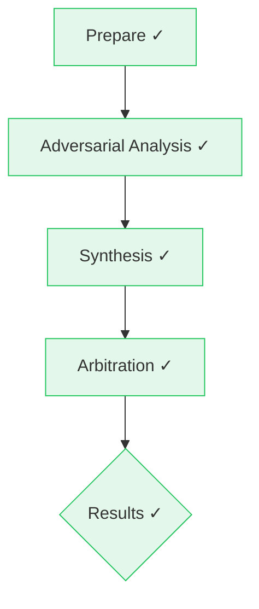

# Ipcha Mistabra Analysis — Summary

**Status:** completed | **Steps:** 5 | **Tokens:** 77,773 | **Cost:** $0.1977 | **Duration:** 2.8m | **Energy:** 16.45 Wh | **Time Saved:** 5.6 min

## Workflow Flow

## Metrics Summary

| Step | Provider | Model | Tokens | Cost | Duration |
|------|----------|-------|--------|------|----------|
| Prepare | google | gemini-2.5-pro | 5,250 | $0.0120 | 25.9s |
| Adversarial Analysis | google | gemini-2.5-pro | 30,500 | $0.0921 | 44.3s |
| Synthesis | google | gemini-2.5-pro | 16,508 | $0.0406 | 42.6s |
| Arbitration | google | gemini-2.5-pro | 16,281 | $0.0333 | 29.0s |
| Results | google | gemini-2.5-pro | 9,234 | $0.0197 | 26.2s |

| **Total** | | | **77,773** | **$0.1977** | **2.8m** |

## Per Provider

| Provider | Model | Tokens | Cost | Calls |
|----------|-------|--------|------|-------|
| google | gemini-2.5-pro | 64,139 | $0.1977 | 8 |
| kimi | kimi-k2-0711-preview | 13,634 | $0.0000 | 4 |
